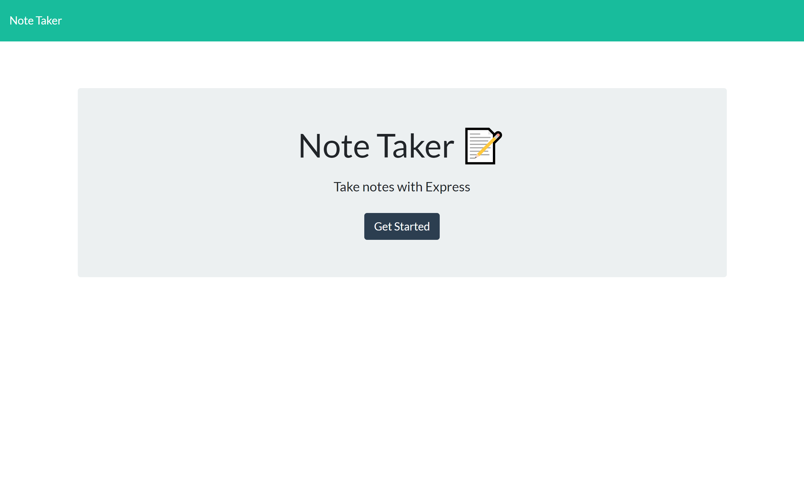
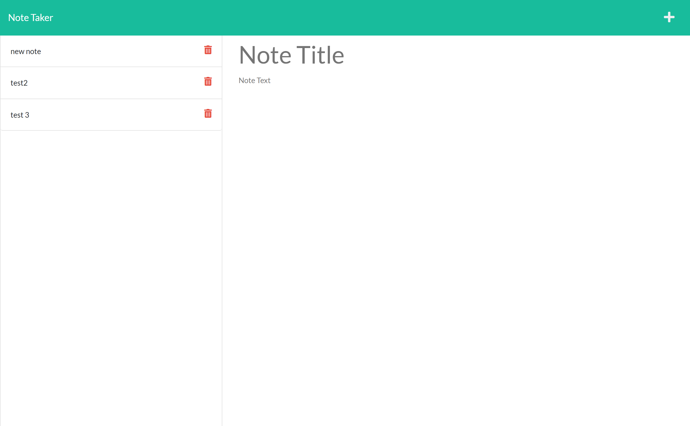

# its-noted

## Description

The purpose of this project was to create an app that allows people to take and save notes as well as delete the notes when they would like.

The front end work was already completed, I was responsible for completing the back end work using Express.js and linking the two for the deployed app.

Delete functionality will be added at a later date.

## Technologies used
* HTML
* CSS
* Express.js
* Heroku (for deployment)

### Links

[Link to the deployed website](https://protected-basin-81306.herokuapp.com/)

